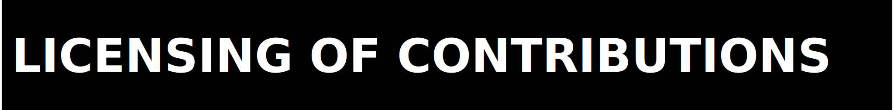

<p>
  
</p>

ZPE-XR welcomes contributions from engineers, evaluators, and adversarial testers. The bar here is evidence, not intent.

<p>
  
</p>

Before you open a PR:

- Negative results are useful; do not suppress them.
- Scope discipline is mandatory; keep XR claims tied to shipped evidence.
- Do not rewrite blocker states into passes.
- Do not commit secrets, local credentials, or machine-specific paths.

<p>
  
</p>

By submitting a contribution you agree that:

- Your contribution is governed by the Zer0pa SAL v6.0 terms in `LICENSE`.
- You retain copyright in your contribution.
- `LICENSE` is the legal source of truth; this file is only an operational summary.

<p>
  
</p>

Current acquisition surface:

- `https://github.com/Zer0pa/ZPE-XR.git`

Recommended contributor path:

```bash
git clone https://github.com/Zer0pa/ZPE-XR.git zpe-xr
cd zpe-xr
python -m venv .venv
source .venv/bin/activate
python -m pip install "./code[dev]"
python ./executable/verify.py
```

If you touch runtime behavior, package surface, or proof scripts, also run:

```bash
python -m pytest ./code/tests -q
```

<p>
  
</p>

Current expected contributor checks:

- `python ./executable/verify.py`
- `python -m pytest ./code/tests -q`
- any affected gate or phase script replay if your change touches proof generation

<p>
  
</p>

- Deterministic codec, parser, or Rust-kernel fixes with proof that behavior improved.
- Documentation corrections that repair broken links, stale evidence paths, or inaccurate claim language.
- Portability and packaging fixes that preserve the existing claim boundary.
- New falsification or benchmark artifacts that sharpen the honest read of the repo.

<p>
  
</p>

- Claim inflation without new evidence.
- Removal of contradictory evidence or blocker language.
- Runtime-closure or public-release language when the governing gates are still open.
- Changes that smuggle in secrets, machine-specific paths, or unverifiable environment assumptions.

<p>
  
</p>

1. Branch from `main` with a descriptive name.
2. Keep the change scoped to one concern.
3. Run the smallest truthful command set that proves the change.
4. Update docs and evidence links if your change affects a claim surface.
5. State exactly what changed, what did not change, and what remains blocked.

<p>
  
</p>

- Use present-tense, imperative commits.
- Keep commits atomic.
- Mention the affected gate, phase, or claim surface when relevant.

<p>
  
</p>

Security questions belong in `SECURITY.md`. General routing lives in `docs/SUPPORT.md`.
