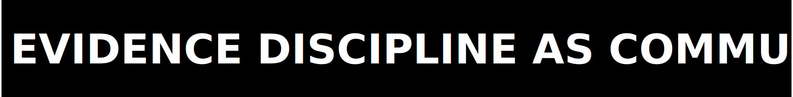

<p>
  
</p>

<table align="center" width="100%" cellpadding="0" cellspacing="0">
  <tr>
    <td width="33%"><a href="README.md"></a></td>
    <td width="33%"><a href="SECURITY.md"></a></td>
    <td width="33%"><a href="GOVERNANCE.md"></a></td>
  </tr>
</table>

# Contributing

This repository is evidence-first. A contribution that narrows uncertainty is useful; a contribution that inflates a claim without proof is not.

<p>
  
</p>

## Ground Rules

- keep scope tight
- do not rewrite historical failures into passes
- do not add claim language unless you also add the proof path
- do not commit secrets, local credentials, or machine-specific paths

<p>
  
</p>

## Setup

```bash
python -m venv .venv
source .venv/bin/activate
python -m pip install "./code[dev]"
python ./executable/verify.py
```

If you touch runtime behavior or proof-generation scripts, also run:

```bash
python -m pytest ./code/tests -q
```

<p>
  
</p>

## Pull Request Bar

- state the exact problem
- list the files changed
- name any claim or proof surface affected
- include the smallest command set that reproduces your result
- leave contradictory evidence in place and explain it

`LICENSE` is the legal source of truth for contribution terms.

<p>
  
</p>
