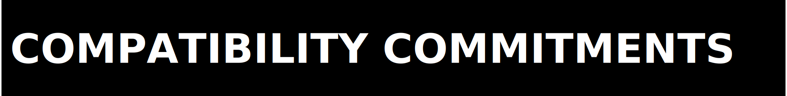

  

  

This document defines the repository governance boundary for evidence handling, release language, and XR-claim discipline.

Canonical anchors:

- Repository: `https://github.com/Zer0pa/ZPE-XR.git`
- Contact: `architects@zer0pa.ai`
- Release posture: `PRIVATE_ONLY`, `NOT_READY_FOR_PUBLIC_RELEASE`

  

Governance baseline:

- Runtime artifacts, package artifacts, and proof artifacts outrank prose when they disagree.
- Contradictions stay visible until resolved; they are not narrated into passes.
- External-license, dataset, and runtime dependencies do not become silent successes.
- XR evidence is workstream-specific; no inherited ZPE-IMC claim is authoritative here unless explicitly re-proved in this repo.

  

| Contract coordinate | Current lock | Evidence |
|---|---|---|
| Package version | `0.3.0` | `release_readiness.json`, `code/pyproject.toml` |
| Primary benchmark authority | `2026-03-21_zpe_xr_phase5_multi_sequence_161900Z` | `proofs/artifacts/2026-03-21_zpe_xr_phase5_multi_sequence_161900Z/phase5_multi_sequence_benchmark.json` |
| Release posture | `PRIVATE_ONLY`, `NOT_READY_FOR_PUBLIC_RELEASE` | `proofs/RELEASE_READINESS_REPORT.md` |
| Runtime closure | `XR-C007 = PAUSED_EXTERNAL` | `proofs/FINAL_STATUS.md` |
| Corpus posture | `ContactPose outward-safe, exact PRD corpus unresolved` | `proofs/FINAL_STATUS.md`, `PUBLIC_AUDIT_LIMITS.md` |

  

| Token | Meaning in this repo |
|---|---|
| `PASS` | Evidence exists and supports the bounded claim at the current repo surface. |
| `PRIVATE_ONLY` | The workstream can be shared or installed privately, but not promoted as a public-release pass. |
| `NOT_READY_FOR_PUBLIC_RELEASE` | A governing public-release gate remains open or failed. |
| `PAUSED_EXTERNAL` | Closure depends on external inputs or permissions outside this repo. |

  

Escalate here when governance questions are live:

- release or claim-boundary disputes: `proofs/FINAL_STATUS.md`, `proofs/RELEASE_READINESS_REPORT.md`
- public-audit disputes: `PUBLIC_AUDIT_LIMITS.md`, `AUDITOR_PLAYBOOK.md`
- license or hosted-use questions: `LICENSE`, `architects@zer0pa.ai`
- unresolved external gates: retain the blocker state instead of rewriting it away
