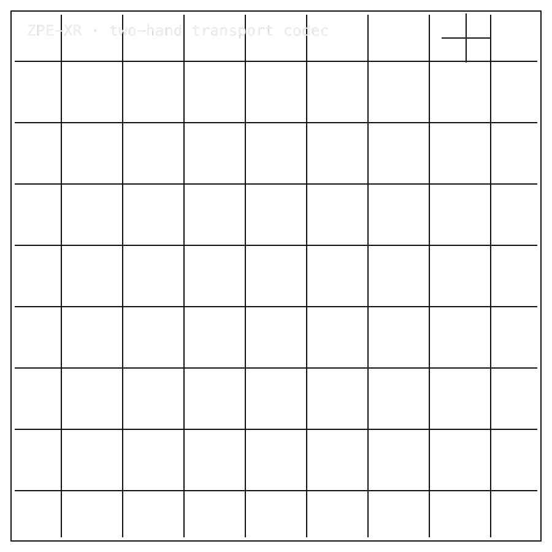

# ZPE-XR

## Package Install

Installable package: `python3.11 -m pip install zpe-xr`.
Current release: `0.3.1` on [PyPI](https://pypi.org/project/zpe-xr/).
Source: [Zer0pa/ZPE-XR](https://github.com/Zer0pa/ZPE-XR/).

```bash
python3.11 -m pip install zpe-xr
```

For full install, smoke, source, and developer commands, [click here](#install-developer-commands-detailed).

---

<table width="100%">
<tr>
<td width="100%" valign="top">
<div><span><b>00 · ZPE-XR</b> · MOTION TRANSPORT</span> <span>RESEARCH-READY · COMPARATOR 0/5</span></div>
      <h1>Hands that travel, <span>byte for byte.</span></h1>
      <p>Two-hand pose transport codec · <em>zpe-xr v0.3.1</em> · github.com/Zer0pa/ZPE-XR</p>
      <p>In a VR session your hands are always moving &mdash; picking up, pointing, reaching across a room. Today that motion is a stream of raw floats, expensive on the network and erased the moment the session ends. ZPE-XR is a different answer: a sealed 25.9-byte packet for two complete hands per frame, decoded in 0.057 ms to <strong>byte-identical</strong> output on any machine, any year. The transport works on ContactPose. Unity and Meta runtime integration is still external; <em>float16+zlib</em> still wins raw fidelity by 0.2 mm.</p>
</td>
</tr>
</table>

<table width="100%">
<tr>
<td width="100%" valign="top">
<figure>
        <div></div>
        <figcaption><b>Scope:</b> ContactPose transport. Comparator 0/5 and runtime closure pending; byte-identical transport is not a fidelity win.</figcaption>
      </figure>
</td>
</tr>
</table>

<table width="100%">
<tr>
<td width="100%" valign="top">
<div><b>01 · THE GAP</b> <span>ARRIVED WRONG</span></div>
      <h2>VR hands arrive late or too large &mdash; the experience <span>breaks before the scene does.</span></h2>
</td>
</tr>
</table>

<table width="100%">
<tr>
<td width="100%" valign="top">
<div><b>02 · MARKETS</b> <span>ADJACENT FORECASTS</span></div>
      <div>
        <div>
          <div><span>Release posture</span>  <span>BLOCKED</span></div>
          <div><span>Hand tracking solutions</span>  <span>$10.9B '33</span></div>
          <div><span>Extended Reality market</span>  <span>$59.2B '31</span></div>
          <div><span>Spatial computing</span>  <span>$280B '28</span></div>
          <div><span>Ultraleap ref revenue</span>  <span>~$30M</span></div>
        </div>
      </div>
      <div>Hand tracking 19.7% CAGR through 2033; XR 41% CAGR to 2031. Transport is the wire all of it runs on.</div>
</td>
</tr>
</table>

<table width="100%">
<tr>
<td width="50%" valign="top">
<div><b>03 · VALUE OF MARKET</b></div>
      <div>23.9<span>×</span></div>
      <div>Smaller than a raw two-hand frame · <b>6.63&times; smaller than Ultraleap VectorHand</b></div>
</td>
<td width="50%" valign="top">
<div><b>04 · INSIGHT</b></div>
      <h2>A hand in motion is <span>data that needs to travel.</span></h2>
</td>
</tr>
</table>

<table width="100%">
<tr>
<td width="50%" valign="top">
<div><b>05.1 · CURRENT TECH</b> <span>FLOAT STREAM AND ZLIB</span></div>
        <p>XR developers ship hand motion as raw float streams or float16+zlib. Both move bytes. Neither is a transport: no sealed packet, no sequence numbering, no loss recovery, no byte-identical replay, no record after the session ends.</p>
</td>
<td width="50%" valign="top">
<div><b>05.2 · OUR TECH</b> <span>SEALED PACKETS</span></div>
        <p>ZPE-XR encodes two complete hands &mdash; 21 joints each &mdash; as a sealed, CRC32-checked packet at <strong>25.9 bytes per frame</strong>, <strong>23.9&times;</strong> smaller than raw. A backup sequence number recovers from drops without a keyframe stall. Encode plus decode runs in <strong>0.057 ms</strong>, and every recorded ContactPose stream plays back the same hands on any machine, any year.</p>
</td>
</tr>
</table>

<table width="100%">
<tr>
<td width="100%" valign="top">
<div><b>05.3 · BENCHMARKS</b> <span>CONTACTPOSE MEASURED</span></div>
      <div>
        <div>
          <div><span>Compression</span><b>23.9&times;</b><small>vs raw</small></div>
          <div><span>Enc+dec</span><b>0.057</b><small>ms</small></div>
          <div><span>MPJPE</span><b>0.479</b><small>mm</small></div>
          <div><span>Comparator</span><b>0/5</b><small>fidelity</small></div>
        </div>
        <div>
          <div><span>Transport size</span>  <span>PASS</span></div>
          <div><span>Round-trip speed</span>  <span>PASS</span></div>
          <div><span>Fidelity</span>  <span>MISS</span></div>
        </div>
      </div>
      <div><b>Scope:</b> ContactPose 5-sequence, 3,500 frames. Transport passes. Fidelity comparator 0/5.</div>
</td>
</tr>
</table>

<table width="100%">
<tr>
<td width="34%" valign="top">
<div><b>06 · MEASUREMENT</b> <span>TRANSPORT VS FIDELITY</span></div>
      <h2>Every transport number ships next to <span>a fidelity reading.</span></h2>
</td>
<td width="66%" valign="top">
<div><b>06.1 · COMPARATIVE PERFORMANCE</b> <span>CONTACTPOSE BYTES PER FRAME</span></div>
      <div>
        <div>
          <div><span>ZPE-XR</span>  <span>25.9 bytes/frame</span></div>
          <div><span>float16+zlib</span>  <span>~110 bytes/frame</span></div>
          <div><span>raw float32</span>  <span>619.5 bytes/frame</span></div>
          <div><span>comparator fidelity</span>  <span>0/5</span></div>
        </div>
      </div>
      <div>ContactPose five-sequence run, 3,500 frames. ZPE-XR ships 25.9 bytes per two-hand frame &mdash; 6.63&times; under Ultraleap, 1.47&times; under Photon Fusion. <em>float16+zlib still wins raw fidelity: 0.277 mm vs 0.479 mm MPJPE &mdash; comparator 0/5.</em></div>
</td>
</tr>
</table>

<table width="100%">
<tr>
<td width="100%" valign="top">
<div><b>07 · KEY METRICS</b> <span>MEASURED RESULTS</span></div>
</td>
</tr>
</table>

<table width="100%">
<tr>
<td width="100%" valign="top">
<div><b>07.1 · VS RAW</b></div>
      <div>23.9<span>×</span></div>
      <div>vs raw float32 · <b>ContactPose two-hand comparator</b></div>
</td>
</tr>
</table>

<table width="100%">
<tr>
<td width="100%" valign="top">
<div><b>07.2 · BYTES / FRAME</b></div>
      <div>25.9<span>B</span></div>
      <div>two complete hands · <b>6.63&times; smaller than Ultraleap</b></div>
</td>
</tr>
</table>

<table width="100%">
<tr>
<td width="100%" valign="top">
<div><b>07.3 · ENC + DEC</b></div>
      <div>0.057<span>ms</span></div>
      <div>encode + decode mean · <b>3,500-frame ContactPose run</b></div>
</td>
</tr>
</table>

<table width="100%">
<tr>
<td width="100%" valign="top">
<div><b>07.4 · MPJPE</b></div>
      <div>0.479<span>mm</span></div>
      <div>ZPE-XR vs 0.277 mm float16+zlib · <b>fidelity comparator 0/5</b></div>
</td>
</tr>
</table>

<table width="100%">
<tr>
<td width="100%" valign="top">
<div><b>07.5 · LOSS @ 10%</b></div>
      <div>0.399<span>%</span></div>
      <div>pose error at 10% loss · <b>9.5&times; more resilient than Ultraleap proxy</b></div>
</td>
</tr>
</table>

<table width="100%">
<tr>
<td width="100%" valign="top">
<div><b>08 · DETERMINISM</b> <span>BOUNDED REPLAY</span></div>
      <h2>Packets replay identically. Deployment evidence <span>stays external.</span></h2>
</td>
</tr>
</table>

<table width="100%">
<tr>
<td width="66%" valign="top">
<div><b>08.1 · WHAT REPLAYS EXACTLY</b> <span>CONTACTPOSE SURFACE</span></div>
      <p>On the measured ContactPose surface &mdash; five sequences, 3,500 frames &mdash; every ZPE-XR packet carries a CRC32 tail and a backup sequence number. The recorded stream decodes byte-for-byte the same on any machine, any year. The checksum is a provenance anchor, not just an error detector.</p>
      <p>The determinism claim is bounded to the encoded stream &mdash; not to the sensor estimating the hand or the engine smoothing the output. <strong>float16+zlib still wins raw fidelity</strong>: 0.277 mm versus 0.479 mm MPJPE. Comparator 0/5; closing that gap is active research.</p>
</td>
<td width="34%" valign="top">
<div><b>08.2 · THE FIDELITY GAP</b></div>
      <span>Honest Blocker ·</span>
      <p><strong>float16+zlib wins fidelity (0.277 mm vs 0.479 mm).</strong> <strong>Comparator 0/5.</strong> Unity and Meta runtime closure is externally dependent. Photon Fusion semantic parity remains an open secondary. Replay-error corpus evidence beyond ContactPose is unresolved. <strong>PyPI zpe-xr 0.3.1 stale; 0.3.2 pending.</strong></p>
</td>
</tr>
</table>

<table width="100%">
<tr>
<td width="33%" valign="top">
<div><b>09</b> </div>
      <h2>WHEN HANDS BECOME <span>PERSISTENT DATA.</span></h2>
</td>
<td width="67%" valign="top">
<div><b>09.1 · THE AMBITION</b></div>
      <p>Embodiment in XR has been disposable. ZPE-XR makes it the opposite: a sealed packet small enough to network at chat-app bandwidth, faithful enough to play back as the same hands every time, and structured enough to search across recordings. Headsets, robots, archives, and training corpora share one transport for motion.</p>
</td>
</tr>
</table>

<table width="100%">
<tr>
<td width="33%" valign="top">
<div><b>09.2 · WHAT WORKS NOW</b></div>
        <h2>A ContactPose-bounded transport: 25.9 bytes per two-hand frame, 0.057 ms round-trip, byte-identical replay under packet loss.</h2>
</td>
<td width="67%" valign="top">
<div><b>09.3 · WHAT'S STILL OPEN</b></div>
        <h2>Raw fidelity against float16+zlib, Unity and Meta runtime closure, Photon semantic parity, broader corpora, and the 0.3.2 release.</h2>
</td>
</tr>
</table>

<table width="100%">
<tr>
<td width="100%" valign="top">
<div><b>09.4</b> &middot; TELEPRESENCE · NEAR-TERM (12–24 MO)</div>
      <div>Multiplayer hands at messaging-app bandwidth</div>
      <div>A four-player social session at 90 fps fits inside 6.84 KB/s &mdash; the bandwidth budget of a chat app, not a video call. Social-VR studios stop paying a voice-call price just to render fingers, and continuous embodied presence becomes a default rather than a feature.</div>
</td>
</tr>
</table>

<table width="100%">
<tr>
<td width="100%" valign="top">
<div><b>09.5</b> &middot; ARCHIVES · NEAR-TERM (12–24 MO)</div>
      <div>Embodied sessions become persistent records</div>
      <div>A two-hour session compresses to roughly 49 MB with no fidelity drift on replay. Coaching reviews, surgical rehearsal, factory walkthroughs, and forensic playback stop ending when the headset comes off. Embodiment graduates from disposable runtime state into a scrubable, hash-addressable record.</div>
</td>
</tr>
</table>

<table width="100%">
<tr>
<td width="100%" valign="top">
<div><b>09.6</b> &middot; MOTION SEARCH · MID-TERM (24–48 MO)</div>
      <div>Hand motion becomes a queryable corpus</div>
      <div>Once every frame is hashed and every gesture fingerprinted, recorded sessions become a search surface. &ldquo;Find every clip where two hands hand off a mug&rdquo; turns into a tractable query. Coaches, ergonomists, and rehab clinicians get a search bar over embodied behavior.</div>
</td>
</tr>
</table>

<table width="100%">
<tr>
<td width="100%" valign="top">
<div><b>09.7</b> &middot; HUMAN-ROBOT REPLAY · MID-TERM (24–48 MO)</div>
      <div>Headset hands and robot arms share a clock</div>
      <div>When a human demonstration and a robot re-run share one packet format, imitation-learning pipelines and teleoperation review collapse into a single timeline with one parity hash. Human-in-the-loop robotics gets a common ground truth where today it has two stacks talking past each other.</div>
</td>
</tr>
</table>

<table width="100%">
<tr>
<td width="100%" valign="top">
<div><b>09.8</b> &middot; PHYSICAL AI · PARADIGM (48 MO+)</div>
      <div>Embodiment becomes network infrastructure</div>
      <div>The same 26-byte envelope that carries a human hand can carry a robot manipulator across headsets, simulators, training agents, and forensic archives without rewriting at each boundary. Spatial computing stops treating presence as a per-engine reconstruction problem; the network itself carries embodiment as a first-class signal.</div>
</td>
</tr>
</table>

---

<a id="install-developer-commands-detailed"></a>

## Install / Developer Commands Detailed

<!-- INSTALL-DX:START -->
#### Package Install

Installable package: `python3.11 -m pip install zpe-xr`.
Current release: `0.3.1` on [PyPI](https://pypi.org/project/zpe-xr/).
Source: [Zer0pa/ZPE-XR](https://github.com/Zer0pa/ZPE-XR/).

```bash
python3.11 -m pip install zpe-xr
```

Import smoke:

```bash
python3.11 - <<'PY'
import importlib.metadata as md
import zpe_xr

print("zpe-xr", md.version("zpe-xr"))
PY
```

Install success only proves package acquisition/import. Product scope, stale PyPI state, platform limits, and blockers remain in the front-door sections below.
- PyPI copy is stale and the wheel matrix is uneven; use Python 3.11 for smoke checks.
<!-- INSTALL-DX:END -->

#### Quick Start

Install from PyPI:

```bash
pip install zpe-xr
```

Verify from source:

```bash
git clone https://github.com/Zer0pa/ZPE-XR.git zpe-xr
cd zpe-xr
python -m venv .venv
source .venv/bin/activate
python -m pip install "./code[dev]"
python ./executable/verify.py
python -m pytest ./code/tests -q
```

Read `docs/ARCHITECTURE.md` first, then `docs/LEGAL_BOUNDARIES.md`, then the Phase 5 and Phase 6 proof anchors above. `LICENSE` is the legal source of truth; the repo uses SAL v7.1.
