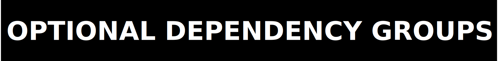
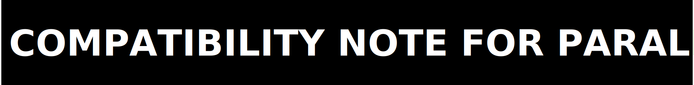

<p>
  
</p>

# zpe-xr

ZPE-XR Python package and Rust-backed kernel surface.

The package exposes:

- `encode`, `decode`, `gesture_match`, `codec_info`
- `XRCodec`, `EncoderState`, `DecoderState`
- `Frame`, `FrameSequence`

Current authority for this package follows the repo-wide XR story: real package mechanics, real benchmark evidence, and explicit blocker states where closure is not yet earned.

<p>
  
</p>

```bash
python -m pip install "./code[dev]"
```

Repo-root operator path:

```bash
python -m venv .venv
source .venv/bin/activate
python -m pip install "./code[dev]"
python ./executable/verify.py
```

<p>
  
</p>

```bash
python examples/streaming_demo.py
python examples/websocket_bridge.py
python examples/contactpose_roundtrip.py
```

<p>
  
</p>

```python
import numpy as np
import zpe_xr

joints = np.zeros((2, zpe_xr.TOTAL_JOINTS, 3), dtype=np.float32)
payload = zpe_xr.encode(joints, frame_rate=90)
decoded = zpe_xr.decode(payload)
info = zpe_xr.codec_info()
```

<p>
  
</p>

- `zpe_xr.encode(joints, frame_rate=FPS) -> bytes`
- `zpe_xr.decode(data) -> numpy.ndarray`
- `zpe_xr.gesture_match(data, vocabulary=None) -> tuple[str, float]`
- `zpe_xr.codec_info() -> dict[str, object]`
- `zpe_xr.XRCodec`, `zpe_xr.EncoderState`, `zpe_xr.DecoderState`
- `zpe_xr.Frame`, `zpe_xr.FrameSequence`

<p>
  
</p>

The published optional dependency groups today are:

- `dev`: build, maturin, pytest, twine, websocket demo, and markdown preview tooling
- `test`: pytest plus websocket demo support
- `docs`: markdown preview tooling

<p>
  
</p>

There is no separate published console-script entrypoint in the package metadata. The governing verification entrypoint is the repo-local script:

- `../executable/verify.py`

<p>
  
</p>

- This package surface is real even though runtime closure is not.
- Package validity does not imply Photon displacement, exact-corpus closure, or public-release readiness.
- The benchmark and blocker surfaces remain governed by the repo root docs, not by this package README alone.
