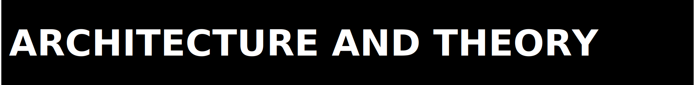
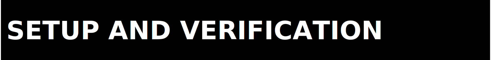

<p>
  
</p>

Organised by topic. If your question is not answered here, use `SUPPORT.md`.

<p>
  
</p>

**What is ZPE-XR?**

ZPE-XR is the Zer0pa XR workstream for a deterministic two-hand pose transport codec and evaluation harness. It combines codec mechanics, benchmark surfaces, package mechanics, and explicit claim boundaries in one repo.

**What is the current strongest honest read?**

The package and the ContactPose benchmark lane are real. The governing public-release comparator gate failed, so this repo is still a private-stage package candidate rather than a public-release pass.

**What is actually proved today?**

- the package builds and installs through the staged path
- the XR codec has a real API and Rust-backed implementation surface
- the ContactPose benchmark lane has current compression, fidelity, latency, and packet-loss numbers
- the repo keeps blocker states explicit instead of hiding them

<p>
  
</p>

**What is the fastest local sanity check?**

```bash
python -m venv .venv
source .venv/bin/activate
python -m pip install "./code[dev]"
python ./executable/verify.py
```

**Is this available on PyPI?**

Yes. `pip install zpe-xr` installs v0.3.0 from PyPI. The source repo is also available at `https://github.com/Zer0pa/ZPE-XR.git`.

**Should I also run tests?**

Yes, when you want a wider local replay:

```bash
python -m pytest ./code/tests -q
```

<p>
  
</p>

**Does this repo prove runtime readiness on Unity or Meta targets?**

No. `XR-C007` remains `PAUSED_EXTERNAL`.

**Does the ContactPose result close the exact PRD corpus question?**

No. ContactPose is the outward-safe benchmark lane, not the exact named PRD corpus.

**Does this repo prove Photon displacement?**

No. Photon remains a secondary open comparator row.

<p>
  
</p>

**What is the current authority anchor?**

The anchor set is:

- `proofs/artifacts/2026-03-21_zpe_xr_phase5_multi_sequence_161900Z/phase5_multi_sequence_benchmark.json`
- `proofs/FINAL_STATUS.md`
- `proofs/RELEASE_READINESS_REPORT.md`
- `release_readiness.json`

**Where are the headline metrics?**

Use the Phase 5 benchmark artifact for the numbers and `proofs/FINAL_STATUS.md` for the honest read of what those numbers do and do not prove.

**What is the governing release verdict?**

`PUBLISHED_PYPI` (v0.3.0). The modern comparator gate remains `0/5 FAIL` and runtime closure remains `PAUSED_EXTERNAL`.

<p>
  
</p>

**What license governs this repo?**

The Zer0pa Source-Available License v6.0. The legal source of truth is `../LICENSE`.

**Where do legal or licensing questions go?**

`architects@zer0pa.ai`

**Are dataset and runtime caveats separate from the license body?**

Yes. See `LEGAL_BOUNDARIES.md` for the operational summary and `../LICENSE` for the legal text.
