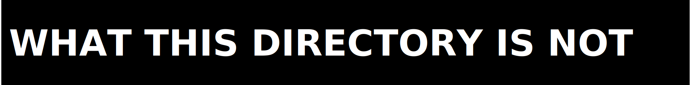

  

Navigation index for the ZPE-XR docs surface.

This directory routes readers into the package surface, claim-boundary surface, and proof-boundary surface for the XR workstream. It follows the same structural discipline as the live ZPE-IMC repo, but the evidence and claims here are XR-specific.

  

| Document | What it covers |
|---|---|
| `docs/FAQ.md` | Fast answers on install, authority, proof limits, and non-claims |
| `docs/SUPPORT.md` | Routing for support, licensing, and security questions |
| `../README.md` | Front door for the whole repo |

  

| Document | Why it matters |
|---|---|
| `docs/ARCHITECTURE.md` | Runtime map, packet envelope summary, proof precedence |
| `docs/LEGAL_BOUNDARIES.md` | Package, dataset, and runtime boundaries |
| `../code/README.md` | Public API and package-install surface |
| `../release_readiness.json` | Machine-readable package verdict |

  

Use these when you want the shortest path through the evidence:

- `../AUDITOR_PLAYBOOK.md`
- `../proofs/runbooks/`

  

| Document | Current role |
|---|---|
| `../proofs/FINAL_STATUS.md` | Current claim boundary |
| `../proofs/RELEASE_READINESS_REPORT.md` | Release verdict and blockers |
| `../CHANGELOG.md` | Version chronology |

  

ZPE-XR inherits the documentation shell, GIF system, and section-bar discipline from ZPE-IMC. It does not inherit ZPE-IMC metrics, statuses, or authority claims. Every promoted statement in this repo must be re-grounded in XR evidence.

  

Start here for the proof corpus:

- `../proofs/README.md`
- `../proofs/FINAL_STATUS.md`
- `../proofs/RELEASE_READINESS_REPORT.md`

  

Stable references for this documentation set:

- `../PUBLIC_AUDIT_LIMITS.md`
- `../AUDITOR_PLAYBOOK.md`
- `DOC_REGISTRY.md`
- `FALSIFICATION_REPORT.md`

  

This directory is not:

- the legal source of truth (`../LICENSE` is)
- the full proof corpus (`../proofs/` is)
- a runtime-closure proof packet
- an external ops archive
